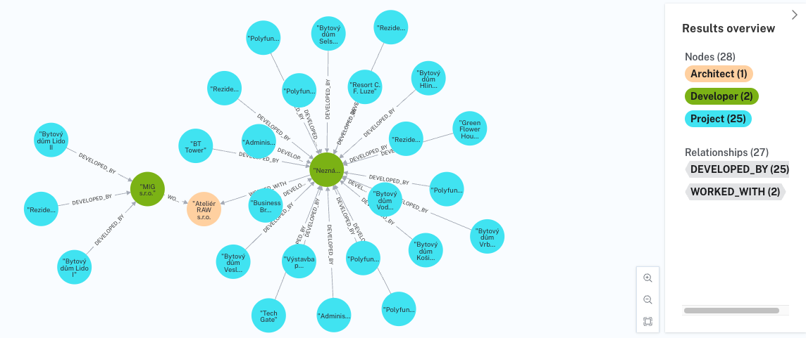

# UPA | Storing data in NOSQL databases

School project which main goal is to get familiar with different types of NoSQL databases such as InfluxDB and Neo4J.

# Requirements

1. Installed InfluxDB on local machine or remote connection to it
2. Neo4J DB instance running on local or remote machine (Aura)

To install bun dependencies:

```bash
bun install
```

To run:

```bash
bun run index.ts
```

# Documentation

## Chosen NoSQL databases

1. Neo4J
2. InfluxDB

## Chosen datasets

1. Neo4J

For the puproses of working with Neo4J database was chosen the following dataset:

- https://data.brno.cz/datasets/mestobrno::brno-brzo-stavební-projekty-a-záměry-brno-brzo-development-projects-and-plans.csv

As a format was chosen ".csv" because there is no need of having geographical features for particular dataset.

It contains a list of development projects in the municipality of Brno where every row is represented as an individual project with information of its developer, architect studio or company, type of investion, state of progress and more. Thus, it can be considered as heterogeneous dataset. Among the potential issues of specific dataset is irregular frequency of updates. The most concerning issue is missing data for some of projects where some fields are left empty. It leads to an aggregation of multiple projects into one during query requests. Specifically for that Cypher offers COALESC function which changes empty values to meaningful ones.

2. InfluxDB

For the puproses of working with InfluxDB database was chosen the following dataset:

- https://www.mesto-bohumin.cz/export/teplota.xml.php

As a format was chosen ".xml" since there were not any other formats.

## Syntax and Semantic definition

1. Neo4J

```cypher
// Load CSV data
LOAD CSV WITH HEADERS FROM "https://data.brno.cz/datasets/mestobrno::brno-brzo-stavební-projekty-a-záměry-brno-brzo-development-projects-and-plans.csv" AS row
MERGE (p:Project {id: row.globalid}) ON CREATE SET
        p.name                  = row.nazev_projektu,
        p.address               = row.adresa,
        p.district              = row.mestska_cast,
        p.description           = row.poznamky
MERGE (d:Developer {name: COALESCE(row.developer_investor, "Neuvedeno")})
MERGE (a:Architect {name: COALESCE(row.architekt, "Neuvedeno")})

// Define relationships between nodes
FOREACH (_ in CASE row.stav WHEN "planovany" THEN [1] ELSE [] END |
        MERGE (p)-[:PLANNED]->(a)
)
FOREACH (_ in CASE row.stav WHEN "v realizaci" THEN [1] ELSE [] END |
        MERGE (p)-[:IN_PROGRESS]->(a)
)
FOREACH (_ in CASE row.stav WHEN "dokonceny" THEN [1] ELSE [] END |
        MERGE (p)-[:COMPLETED]->(a)
)
FOREACH (_ in CASE row.typ_investice WHEN "soukroma" THEN [1] ELSE [] END |
        MERGE (d)-[:INVESTED_PRIVATLY]->(p)
)
FOREACH (_ in CASE row.typ_investice WHEN "verejna" THEN [1] ELSE [] END |
        MERGE (d)-[:INVESTED_PUBLICLY]->(p)
)
FOREACH (_ in CASE row.typ_investice WHEN "Strategicky_projekt_mesta_Brna" THEN [1] ELSE [] END |
        MERGE (d)-[:INVESTED_STRATEGICALLY]->(p)
)

MERGE (p)-[:DEVELOPED_BY]->(d)
MERGE (p)-[:ARCHITECTED_BY]->(a)
MERGE (d)-[:WORKED_WITH]->(a);

```

2. InfluxDB

## Import of data

1. Neo4J

In order to import data for Neo4J were used the following tools:

- [Neo4j Aura DB](https://neo4j.com/cloud/platform/aura-graph-database/)
- [cypher-shell](https://neo4j.com/docs/operations-manual/current/tools/cypher-shell/)

Firstly was created an instance of remotely running neo4j database with help of Aura DB. Afterwards, the connection between remote database and local machine were established via cypher-shell with provided Aura DB credentials such as user, password and url of running instance. Cypher query language served as a tool for runing queries to upload data.

## Example of queries

### Remove all nodes

```cypher
match (n) detach delete n;
```

### Query architects and developers with common projects

```cypher
match q=(a:Architect)<--(project)<-[:DEVELOPED_BY]-(developer) return q limit 25;
```

Result:

_Screenshot from neo4j console_

# Issues

1. https://github.com/neo4j/neo4j-javascript-driver/issues/1140
